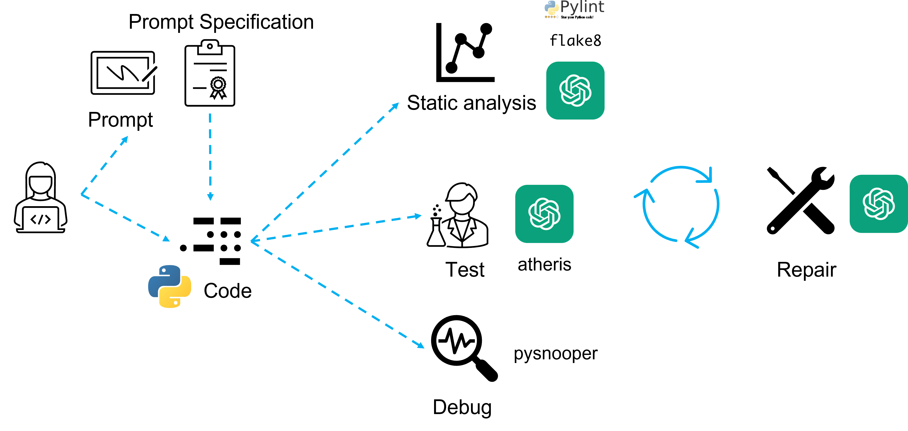

# Pythonic ChatGPT: Tool-armed ChatGPT Python programmer

Pythonic ChatGPT connects ChatGPT and a series of Python tools to synthesize code and enhances code quality through prompt specification, linting, testing, debugging, and repairing Python code. It is designed to be modular, allowing users to extend and add new tools (e.g., tester) and large language models (e.g., Bard).

This is a research project aimed at exploring new paradigms in development tools.

Run your prompts or Python scripts with Pythonic ChatGPT. Pythonic ChatGPT will automatic verify and repair it. Even if you have many bugs it will repeatedly rerun until it's fixed.

Note that Pythonic ChatGPT rely on ChatGPT to perform certain tasks, which introduces non-determinism. If you encounter failures due to ChatGPT, please try re-executing the tool to attempt repair. As LLM (Language Model) becomes more powerful, in the future, some of the tools' functions may be directly performed by LLM.

## Prerequisite 

Read the file [CONTRIBUTING.md](CONTRIBUTING.md). Then clone your new project, configure the env and happy coding!

```bash
python3 setup.py install
```

##  System Architecture 
 
<p align="center"></p>

## Quick Start

```
# clone the repo
git clone https://github.com/DeepPrompting/pythonic-chatgpt.git

# go to directory
cd pythonic-chatgpt

# create a new environment
conda create -n pygpt python=3.8

# activate the new environment
conda activate pygpt

# prepare the basic environments
pip install -r requirements.txt

# prepare your private OpenAI key (for Linux)
export OPENAI_API_KEY={Your_Private_Openai_Key}

# run the script
cd pygpt

# run with your code
python3 pygpt_runner.py --process code --code_path sample/loop.py  

# run with your code generation prompt
python3 pygpt_runner.py --process prompt --prompt_path sample/prompt.txt      
```

## Acknowledgement
We appreciate the open source of the following projects:

[atheris_libprotobuf_mutator](https://github.com/google/atheris/blob/master/contrib/libprotobuf_mutator/atheris_libprotobuf_mutator)
[python-project-template](https://github.com/rochacbruno/python-project-template) &#8194;

## Contact Information
For help or issues using the Pythonic ChatGPT, please submit a GitHub issue.

For other communications, please contact the contributor.

## Development

1. Read the file [CONTRIBUTING.md](CONTRIBUTING.md). Then clone your new project and happy coding!
